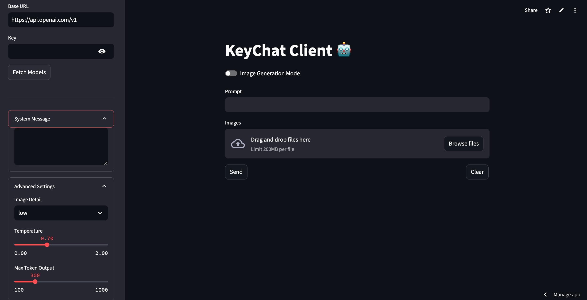
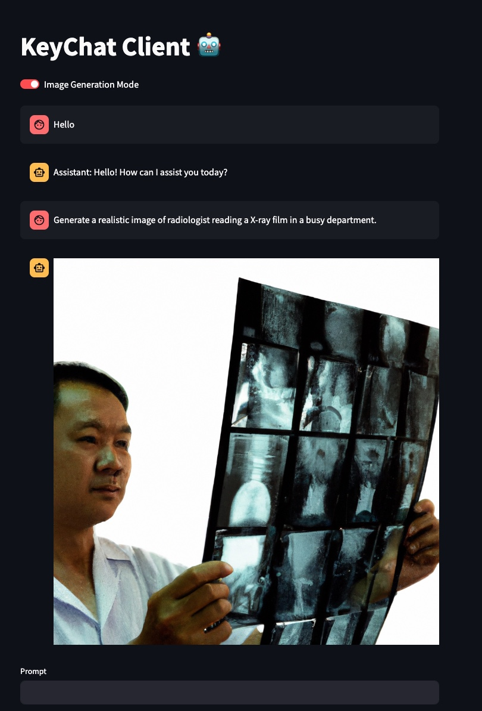

# KeyChat: A Multimodal Chat App with Streamlit 🔑💬

KeyChat is a versatile chat application built with Streamlit that allows you to interact with various Large Language Models (LLMs) and image generation models, supporting both text and image inputs. It provides a user-friendly interface for experimenting with different models and settings, enabling both text/vision-based chat and image generation.


## Features ✨

* **Multimodal Input:** Send text messages and upload images as part of your conversation. 🖼️➡️💬
* **Text/Vision Chat:** Engage in conversations with LLMs that can process both text and visual information. 👀+📝
* **Image Generation:** Generate images based on text prompts using dedicated image generation models. 🎨🤖
* **Model Selection:** Choose from a list of available text/vision and image generation models fetched directly from the API.  ✅
* **Customizable Settings:** Adjust parameters like temperature, max tokens, and image detail level. ⚙️
* **System Message:** Define a persistent system message to guide the LLM's behavior. 🗣️
* **Chat History:** View previous messages in a convenient chat interface. 📜
* **Clear Chat:** Easily clear the chat history to start a new conversation. 🧹
* **Custom Base URL:**  Allows you to connect to different OpenAI compatible API endpoints. 🌐


## Installation 🛠️

1. **Clone the repository:**

   ```bash
   git clone https://github.com/drankush/KeyChat/.git 
   cd keychat
   ```

2. **Install required packages:**

   ```bash
   pip install -r requirements.txt
   ```

3. **Demo:**

   ```bash
   https://keychat.streamlit.app/
   ```


## Usage 🚀

1. **Run the app:**

   ```bash
   streamlit run app.py
   ```

2. **Enter your OpenAI API key and Base URL:** In the sidebar, enter your API key and the base URL for the API endpoint. 🔑
3. **Fetch Models:** Click the "Fetch Models" button to retrieve the available text/vision and image generation models. 🔄
4. **Select Models:** Choose your desired text/vision model and image generation model from the dropdown menus in the sidebar.  ⬇️
5. **Optional: Set System Message:** Provide a system message in the sidebar to guide the LLM's responses. 🤖💬
6. **Optional: Adjust Advanced Settings:** Customize the temperature, max tokens, and image detail in the sidebar. 🌡️


<p align="center">
  
</p>


7. **Enter your prompt:** Type your message in the text input area.  📝
8. **Optional: Upload Images:** Upload images using the file uploader. Supported formats: .jpg, .png, .gif, .webp 🖼️⬆️
9. **Send your message:** Click the "Send" button to submit your prompt and/or images to the selected model. 🚀
10. **Toggle Image Generation Mode:** Use the toggle to switch between Text/Vision Chat and Image Generation mode. In Image Generation mode, only the text input will be used as the prompt to generate an image. 🖼️

<p align="center">
  
</p>

11. **Clear the chat:** Click the "Clear" button to erase the chat history. 🧹


## Troubleshooting ⚠️

* **Error Fetching Models:** Double-check your API key and Base URL. Ensure your network connection is stable and that the OpenAI API is accessible. 📶
* **Image Upload Issues:** Verify that the uploaded images are in a supported format (.jpg, .png, .gif, or .webp). 🖼️
* **Other Errors:** Pay attention to the error messages displayed in the app. They often provide clues about the issue. Common errors like "500" may indicate problems with the model provider's services, while "401" usually signifies an incorrect API Key. ❌


## Contributing 🙌

Contributions are welcome! Please feel free to submit bug reports, feature requests, or pull requests.


## License
This project is licensed under the MIT License.  📄

